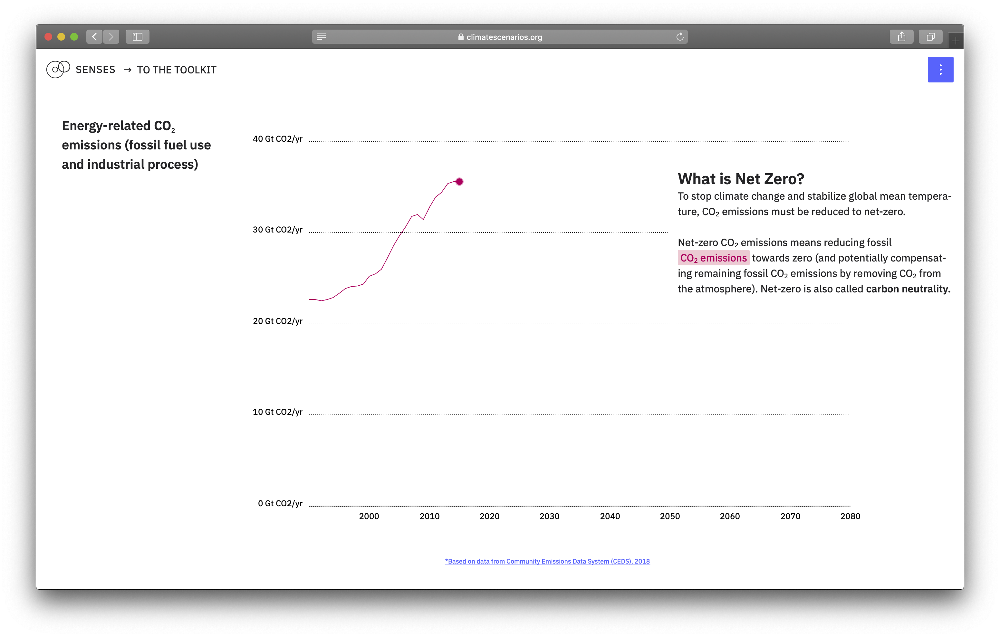

# Towards an Electric Future
This repository contains the code for [*Towards an Electric Future*](https://dev.climatescenarios.org/sector-transition/), where sectorial transition and electrification is unpacked. It is part of the [SENSES Toolkit](https://climatescenarios.org/).



## License

The source code is licensed under the [ISC license](LICENSE.md). Text and graphics are licensed under [Attribution-ShareAlike 4.0 International](https://creativecommons.org/licenses/by-sa/4.0/). For licensing information on datasets please refer to the data sources section. Exceptions are listed below on a per-file basis.

## Data Sources

Data sources and if applicable licenses are listed below on a per-file basis.

- `src/assets/data/emissions_historical-new.json` and `src/assets/data/emissions_merged-new.json` are both [CEDS](https://gmd.copernicus.org/articles/11/369/2018/) data, with a CC BY 3.0 license - no changes were applied from the original source.
- `electrificaiton-trends.json`: No applicable license.

## Last update on:
October 20th, 2020

## Project setup
```
npm install
```

### Compiles and hot-reloads for development
```
npm run serve
```

### Compiles and minifies for production
```
npm run build
```

### Run your tests
```
npm run test
```

### Lints and fixes files
```
npm run lint
```

### Customize configuration
See [Configuration Reference](https://cli.vuejs.org/config/).
